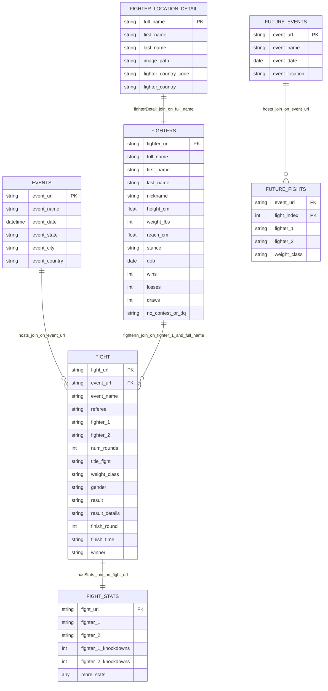

# ufc-prediction-service
UFC containerized flask web application

```mermaid
erDiagram
    EVENTS {
        string event_url PK
        string event_name
        datetime event_date
        string event_state
        string event_city
        string event_country
    }

    FIGHT {
        string fight_url PK
        string event_url FK
        string event_name
        string referee
        string fighter_1
        string fighter_2
        int num_rounds
        string title_fight
        string weight_class
        string gender
        string result
        string result_details
        int finish_round
        string finish_time
        string winner
    }

    FIGHT_STATS {
        string fight_url FK
        string fighter_1
        string fighter_2
        int fighter_1_knockdowns
        int fighter_2_knockdowns
        any more_stats
    }

    FIGHTERS {
        string fighter_url PK
        string full_name
        string first_name
        string last_name
        string nickname
        float height_cm
        int weight_lbs
        float reach_cm
        string stance
        date dob
        int wins
        int losses
        int draws
        string no_contest_or_dq
    }

    FIGHTER_LOCATION_DETAIL {
        string full_name PK
        string first_name
        string last_name
        string image_path
        string fighter_country_code
        string fighter_country
    }

    FUTURE_EVENTS {
        string event_url PK
        string event_name
        date event_date
        string event_location

    }

    FUTURE_FIGHTS {
        string event_url FK
        int fight_index PK
        string fighter_1
        string fighter_2
        string weight_class
    }

    EVENTS ||--o{ FIGHT : hosts_join_on_event_url
    FIGHT ||--|| FIGHT_STATS : hasStats_join_on_fight_url
    FIGHTERS ||--o{ FIGHT : fighterIn_join_on_fighter_1_and_full_name
    FIGHTER_LOCATION_DETAIL ||--|| FIGHTERS : fighterDetail_join_on_full_name
    FUTURE_EVENTS ||--o{ FUTURE_FIGHTS: hosts_join_on_event_url
```
